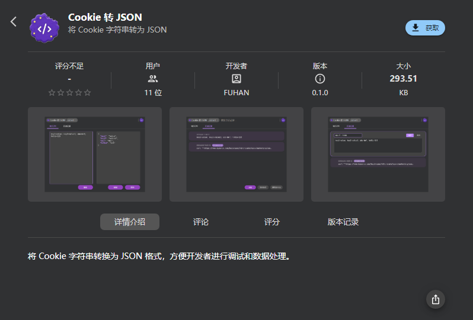

# Cookie 转 JSON

这是一个 uTools 插件，用于将 Cookie 字符串转换为 JSON 格式，方便开发者进行调试和数据处理。

## 功能特点

- 支持将 Cookie 字符串快速转换为 JSON 格式
- 支持智能识别 curl 字符串中的 Cookie 信息
- 支持一键复制转换结果
- 转换历史记录的增、删、改、查

## 安装

已发布到 uTools 插件应用市场，可直接输入“Cookie 转 JSON”搜索插件进行安装。

## 许可证

MIT License
